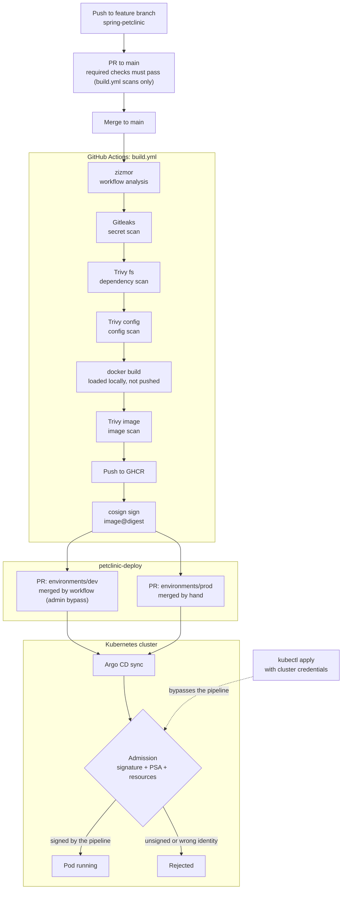

# petclinic-deploy

A GitOps project with a security focus. I took the Spring PetClinic sample app, built a CI pipeline that scans and signs the image, and deploy it to dev and prod with Argo CD. I took under consideration the fact that despite CI checks anyone with cluster access can just `kubectl apply` an image and skip them, so the cluster also checks the signature and refuses anything the pipeline didn't sign.

| Repository | Contents |
|---|---|
| [PtrMlnda/spring-petclinic](https://github.com/PtrMlnda/spring-petclinic) | Fork of the upstream [Spring PetClinic](https://github.com/spring-projects/spring-petclinic). The application code (`src/`) is unmodified. The fork adds a multi-stage `Dockerfile`, `.dockerignore`, the workflow `.github/workflows/build.yml` and one Tomcat version pin in `pom.xml` (original Tomcat version was flagged by one of the vulnerability sca). It removes the upstream Gradle build, Kubernetes manifests and workflows. |
| [PtrMlnda/petclinic-deploy](https://github.com/PtrMlnda/petclinic-deploy) (this repo) | `base/` manifests, Kustomize overlays in `environments/dev` and `environments/prod`, Argo CD Applications and AppProjects in `argocd/`, Kyverno policies in `policies/`, policy tests in `tests/`. |

## Architecture

## Pipeline stages

There are six security layers, and each answers a question the others cannot. Adding a second scanner to an existing layer would add redundancy, not a new layer.

| # | Layer | Tool | Gate | What it catches |
|---|---|---|---|---|
| 1 | Workflow static analysis | zizmor | `workflow-analysis` job; `build` needs it | Security weaknesses in the GitHub Actions workflow itself |
| 2 | Secret scanning | Gitleaks | same job, full history (`fetch-depth: 0`) | Credentials committed anywhere in git history |
| 3 | Dependency scanning | Trivy `fs` | `CRITICAL`, fixable only, `exit-code: 1` | Vulnerable dependencies declared in the repository |
| 4 | Config scanning | Trivy `config` | `HIGH,CRITICAL`, `exit-code: 1` | Misconfigurations in the `Dockerfile` and other config files |
| 5 | Image scanning | Trivy `image` | `CRITICAL`, fixable only, `exit-code: 1` | Vulnerabilities in the built image: base OS packages and the dependencies packaged into it |
| 6 | Admission | Kyverno | `Deny` at the API server | Pod images without a valid signature from the pipeline, however the pod was submitted |

Each Trivy gate is followed by a report step that runs even when the gate fails. The JSON reports and a SBOM are uploaded as the `scan-reports` artifact.

Other properties of the workflow:

- **Nothing that fails a gate reaches the registry.** The image is built with `push: false, load: true` and scanned locally. It is pushed to `ghcr.io/ptrmlnda/petclinic` only after every gate has passed.
- **`main` is protected (both App and Deploy repos).** Changes go through a feature branch and a pull request, and `workflow-analysis` and `build` are required checks, so a PR can't be merged if a gate fails. After the merge the workflow runs again on `main`, and only that run pushes, signs and opens promotion PRs.
- **Least privilege.** The workflow sets `permissions: {}` at the top level and grants permissions per job. Checkouts use `persist-credentials: false`, and every action is pinned to a full commit SHA.
- **Digests, not tags.** A tag can be moved to point at a different image, a digest can't. Cosign signs the digest, and the overlays deploy that same digest, so it's the same ID from build to cluster.

## What the cluster checks

The cluster checks two things before a pod is allowed to start.

**1. Was this image signed by my pipeline?**

This is the check the whole project is built around. It doesn't matter if the pod came from Argo CD or someone ran `kubectl apply` by hand, the check is the same.

- `policies/verify-image-signature.yaml` blocks any pod in `petclinic-dev` or `petclinic-prod` if one of its images (normal, init or ephemeral containers) isn't signed by the CI pipeline's workflow identity.
- `policies/verify-image-signature-eph.yaml` does the same for ephemeral containers, so you can't use an unsigned image in with `kubectl debug`.

**2. Does the pod follow basic security/quality standards?**

More of a baseline, not the main focus.

- Pod Security Admission, turned on with namespace labels.
- `policies/require-requests-limits-{dev,prod}.yaml` require CPU and memory requests plus a memory limit on every container and init container. Dev only reports it (`Audit`), prod blocks it (`Deny`). Tests for the dev one are in `tests/require-requests-limits/`.
- `base/deployment.yaml` runs as non-root (UID 1001) with a read-only root filesystem, no privilege escalation, all capabilities dropped, the `RuntimeDefault` seccomp profile and no service account token.

**I removed a policy that never did anything.** I had a `disallow-privileged` policy, but Pod Security Admission runs first, so mine never got a chance to fire in a labelled namespace. I checked that it did work by pointing it at a namespace without the PSA label, then deleted it (commit `7439c05`) instead of keeping it just for show.

**Argo CD manages the policies, not Kyverno.** The `kyverno-policies` app syncs `policies/`. To keep matters simpler, Kyverno is not managed by Argo CD but is installed separately.

The app and the policies live in separate Argo CD projects:

| Project | Deploys to | Allowed resources |
|---|---|---|
| `petclinic-app` | `petclinic-dev`, `petclinic-prod` | `Deployment`, `Service`, nothing cluster-wide |
| `petclinic-policy` | `kyverno` | Kyverno `ValidatingPolicy` and `ImageValidatingPolicy` only |

Kyverno policies are cluster-wide, and the app project can't touch anything cluster-wide, so a bad change to the app manifests can't loosen the policies. The `fault/policy-injection` branch has the test for this: a policy slipped into the dev overlay.

## Promotion flow

The image is built once and the same digest goes to dev and then prod, so what I tested is exactly what ships. `main` here is protected too (PR + code owner review, admins can bypass).

1. After signing, the workflow checks out this repository using the `DEPLOY_PAT` secret.
2. For each environment it creates a branch `promote-<env>-<commit-sha>`. It writes the digest into `environments/<env>/kustomization.yaml` with `yq` (`.images[0].digest`) and opens a pull request.
3. **Dev:** the workflow merges the PR with `gh pr merge --squash --admin`, using the admin bypass in the ruleset. The `petclinic-dev` Application syncs automatically (`prune: true`, `selfHeal: true`).
4. **Prod:** the workflow does not merge the PR. `CODEOWNERS` assigns `/environments/prod/` to the maintainer, who is the only one, so the PR is merged by hand with the admin bypass (see Status). Merging it triggers the `petclinic-prod` sync.

## Environment

Everything runs locally:

- **Cluster:** single-node k3s (`v1.36.4+k3s1`) inside WSL2 (Ubuntu 24.04).
- **Argo CD** `v3.5.2` and **Kyverno** `v1.19.0` are installed and set up by hand, not through GitOps. Kyverno comes from its Helm chart (`kyverno-3.9.0`).
- **Namespaces:** `petclinic-dev` and `petclinic-prod` are labelled `pod-security.kubernetes.io/enforce=restricted`. The namespaces themselves aren't in the repo.
- **Bootstrap:** the Applications and AppProjects in `argocd/` are applied by hand. After that, Argo CD syncs everything else from this repo.

## Tech stack

| Area | Tool | As pinned in the repositories |
|---|---|---|
| Application | Spring Boot (upstream PetClinic) | `spring-boot-starter-parent` 4.1.0, `tomcat.version` 11.0.25 |
| Container | Docker multi-stage build | `maven:3.9-eclipse-temurin-21` → `eclipse-temurin:21.0.12_8-jre`, non-root UID 1001 |
| CI | GitHub Actions | all actions pinned by commit SHA |
| Workflow analysis | zizmor | `zizmorcore/zizmor-action` v0.6.3 |
| Secret scanning | Gitleaks | `gitleaks/gitleaks-action` v3.0.0 |
| Vulnerability and config scanning | Trivy | `aquasecurity/trivy-action` v0.36.0 |
| SBOM | Syft | `anchore/sbom-action` v0.24.2 |
| Signing | cosign, keyless (OIDC) | `sigstore/cosign-installer` v4.1.2 |
| Registry | GitHub Container Registry | `ghcr.io/ptrmlnda/petclinic` |
| Manifests | Kustomize | `base/` + `environments/{dev,prod}` |
| GitOps | Argo CD | `argoproj.io/v1alpha1` Application, AppProject |
| Admission | Kyverno; Kubernetes Pod Security Admission | `policies.kyverno.io/v1` ValidatingPolicy, ImageValidatingPolicy |
| Policy tests | Kyverno CLI | `cli.kyverno.io/v1` Test |

## Known limitations

The implementation is done. Things I know aren't perfect:

- **No real review.** It's a one-person repo, so there's nobody to review PRs. The workflow merges dev promotions with `--admin`, and I merge prod ones myself with the admin bypass.
- **The scanned image and the pushed image come from two build steps.** The push step runs `docker/build-push-action` again using the layer cache, instead of pushing the exact image that was scanned.
- **The signature policies have no tests here.** Only the dev requests/limits policy has Kyverno CLI tests in `tests/` (ImageValidatingPolicy is not supported by Kyvenro test tool).
- **Cluster setup isn't in the repo.** Argo CD, Kyverno, the namespaces and the `argocd/` manifests are set up by hand (see Environment).
